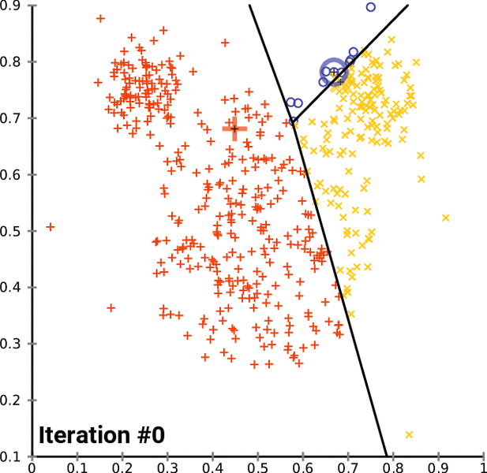

# Understanding how Big Data and Machine Learning are Related

  - **Subject Area(s):** Computer Science
  - **Associated Unit:** None
  - **Lesson Title:** Understanding how Big Data and Machine Learning are Related
  - **Grade Level:** 12+
  - **Lesson #:** 1 of 1
  - **Lesson Dependency:** None
  - **Time Required:** 150 minutes

## Summary

Students will learn how some simple Machine Learning algorithms can be used to separate and predict the categorization of data. These concepts are demonstrated in the context of large data sets and the association between large data sets and Machine Learning algorithms is discussed. This will lead to a discussion of the ideas of supervised vs unsupervised learning and the workings of k-means and SVM algorithms. The lesson concludes with students attempting to have a machine-learning program predict movies they will like based on other movies they have categorized.

## Engineering Connection

Most computer users (and many non-computer users) encounter scenarios every day that use predictive technologies to enhance their experience with products, services, and systems. The popular shopping site **Amazon** uses massive data sets to help users find products of interest or relevance. The movie watching service **Netflix** uses similar methods to help users find entertainment that may interest them. These systems rely on computer engineers developing systems that can process data and extract patterns and meaning from it. As these systems become more popular and ubiquitous, the computer scientists and engineers entering the field in the next  decade will require some familiarity and exposure to these concepts. For the common, user, an understanding of these technologies will help prevent misuse and an understanding of the limits of these systems to better empower people to make decisions and assess the place of learning algorithms in society.

## Engineering Category

Relating science and/or math concept(s) to engineering

## Keywords

  - Machine Learning
  - Big Data
  - Algorithm
  - k-means
  - SVM

## Educational Standards

**ITEEA** - Standards for Technological Literacy: Content for the Study of Technology
  * Abilities for a Technological World (Grades K - 12)
    * 13. Students will develop abilities to assess the impact of products and systems. (Grades K - 12) Details...
      * As part of learning how to assess the impact of products and systems, students should learn that: (Grades K - 12)
      * J. Collect information and evaluate its quality. (Grades 9 - 12) Details...
      * K. Synthesize data, analyze trends, and draw conclusions regarding the effect of technology on the individual, society, and environment. (Grades 9 - 12)

**NGSS** - Science is a Human Endeavor (Grades 3 - 12)
  * Science and engineering are influenced by society and society is influenced by science and engineering. (Grades 9 - 12)

## Pre-Requisite Knowledge

  - Use of graphing and charting using spreadsheet software.
  - Basic programming concepts.
  - Algorithms.

## Learning Objectives

After this lesson, students should be able to:

  * Summarize the usage and relevance of machine learning algorithms such as SVM and k-means.
  * Explain how the k-means and SVM algorithms relate to predictive computer programs.
  * Describe sources of Big Data and explain the relevance to Machine Learning.

## Introduction / Motivation

Using computers to make predictions in a given problem space is essential in allowing expert knowledge to scale. For instance, in the field of cancer diagnosis, prediction is generally made by a human expert after reviewing a tissue sample (histological slide) and assessing the relative arrangements of tissue structures such as cell nuclei. Creating computer algorithms that can rate probabilities based on a digital version of the same slide can reduce the burden on high level expert staff the time necessary to diagnose cancer by allowing experts to focus only images with high probability or ambiguous structures. In resource restricted environments, this could also allow a few experts to treat many more patients.

Machine Learning and Big Data tend to be inherently linked concepts. The reason for this is that it necessary to “train” a Machine Learning algorithm with a data set. As more data tends to improve the precision of the model, large data sets are ideal for machine learning algorithms. Further, large data sets often contain valuable information that is difficult for a person to comprehend or visualize. Computers are ideal at analyzing this data and extracting patterns.

Two easy to discuss and visualize machine learning algorithms are k-means clustering and SVM (support vector machine) which can both separate data in a simple 2-dimensional cartesian plane as well as work in higher order dimensions.

K-means is an example of an unsupervised learning algorithm. It will produce equations which separate a set of data into a specified number of partitions. K-means does this by using standard mathematical averages and finding the nearest average center to a given point. This is done without the algorithm having access to the true cluster that a given point belongs and hence the algorithm is “unsupervised”.

SVM separates data according to a set of vectors. In principle, the data is separated linearly though more complex equations can also be generated. SVM is an example of a supervised algorithm in that the training data must be labeled as to which group it belongs. The algorithm will converge on a solution that separates this data so that new data points can be evaluated by determining on which side of the separation boundary the point falls.
These techniques can be used to make predictions about data based on previous examples (a training set).

## Lesson Background & Concepts for Teachers

What do we mean when we talk about “Big Data”. This topic is very popular right now and is tightly linked to the concept of “Machine Learning”. Why is this and what exactly are these two fields and why are they related.

Let us first start with some formal definitions:

Machine Learning is the branch of computer science dealing with programs and algorithms that can be used to classify or identify data not by being instructed, but by first observing numerous samples. Machine Learning algorithms are designed to adjust a predictive equation in response to each item in a set of data or each change in a set of data. The observation and subsequent changes to the predictive equation is called “training” the model.

Big Data refers to very large samples of data. Usually so large and often with so many different attributes that it is hard for a person to identify any particular pattern or useful information from the data or store using traditional systems. The data is accumulated in all sorts of different ways. Imagine looking at every credit card transaction record produced by every point of sale machine in a large chain store. Each record would have date and time information, the names and SKU numbers of all items purchased, the prices of each product, the name and credit card type of the purchaser, and whether any discounts were applied and to which items they were applied. This is just a few of the obvious data attributes. There are probably many other attributes that are less obvious. You could imagine that there are troves of interesting information in this data. What products are favored by people with male names vs people with female names? Are certain products more popular at certain times of the month, day, year, or week? Is there a correlation to how many items people purchase and the time of day. Do people who purchase higher value items purchase more or fewer items than people who purchase lower value items. A human looking at the data would have a very hard time making any sense of it to answer any of these questions.

A computer is very good at doing iterative tasks. Running loops and summing large quantities of data are some of the purposes for which computers were originally designed.

As a simple example, imagine you wanted to write a program that would win at betting on guessing whether a flipped coin was going to be heads or tails. This is normally not a winning proposition as the number of “heads” vs “tails” flips have 50:50 odds. But if you had a massive sample based on watching previously flipped coins and found that the particular coin being used for the game were slightly imbalanced, you could produce a program that would calculate this and then bet on the more likely side. This program would have discerned something from the physical world by reviewing a large data sample and then would use that to make a prediction about how best to act based on that data. Though not a very good or exciting program, this could be considered a very simple example of Machine Learning.

The reason Machine Learning and Big Data are often talked about together is based on this idea. In order to produce a model that can accurately predict real world behaviors, it is necessary to view many, many data samples. Without large quantities of data, our model will not have a chance of producing anything realistic.

Let us look now at a real-world example. This example uses a Machine Learning algorithm called k-means clustering. K-means clustering is an unsupervised algorithm. This means that it does not need to be instructed about any of the previous data samples to classify new samples. K-means works by trying to find lines that separate samples into groups. The number of groups is defined by the programmer or person running the algorithm. A great example of this is trying to identify coins based on the weight and diameter. In the U.S. there are four common coin denominations. $0.01, $0.05, $0.10, $0.25. There are also $0.50 and $1.00 coins but they are far less common. K-means would be a good algorithm to use to help decide if a newly seen coin was one of these four. Note that if we look at a scatter plot with just a few coins, we can’t see much of a pattern.

But as we add many coins we find it becomes increasingly easy to draw lines to separate the data. So our algorithm should produce better results.

K-means works by starting with some random lines to separate the data. Then it tests all the points and reclassifies them according to the distance to the mean point in the cluster. As each iteration occurs, some points change the cluster they have been categorized as belonging to. The algorithm generally continues until none of the points change categorizations between iterations.

The Wikipedia page on K-means has a great diagram demonstrating this.

From: https://en.wikipedia.org/wiki/K-means_clustering#/media/File:K-means_convergence.gif

Once our algorithm has been “trained” on the prior data set, we have a series of equations that determine lines. We can take a new data observation and test to see where within our lines it falls and thus our model can “predict” what type of coin we have based on the data it has previously classified.

Another easy to grasp Machine Learning algorithm is known as a Support Vector Machine or SVM. SVM works in a similar way to K-means in that it produces equations that separate data. In the case of SVM however, the programmer must inform the model what the data is. This is known as a supervised model. We have a set of known data and we let the model produce a way to separate this data as best it can by creating lines on a Cartesian plane or planes in 3D space. In principle, SVM can separate data in any dimension of space which is helpful if you have data with many properties beyond three.

Again, with a very few points it is hard to discern if the best solution to the algorithm is actually the best general solution. If we draw only two points on a Cartesian plane, then there is a single best SVM the separates them, but this may not be a good solution to the general problem with all the many possible outliers. This is why we need to “train” our algorithm with a large data sample.

## Interactive Example

To see the idea of training a model, I have created a simple (and likely very poor) program that will attempt to determine if you will like a given movie (or set of movies). It works like this…

The program uses a large CSV file that has thousands of movies and many attributes about these movies. It includes the genres and lead actors and directors.

If you go through the CSV file and add a zero “0” next to a movie’s name, that designates it as a movie you did not like. If you put a one “1” next to the movie’s name, that designates it as a movie you did like. Putting the letter “p” for “predict” designates that you would like the program to predict if you would like the movie or not.

This program uses a simple SVM as described above (albeit one that has many dimensions). The program tries to create a plane that separates the movies into “like” vs “dislike” categories. It doesn’t know this though. It just uses the model to see if a new movie should be categorized as a zero or a one.

If you only rate two movies and ask for a prediction, the prediction is quite poor. There will probably be only a 50:50 chance that the prediction will match reality. But as you categorize many movies including ones you don’t like, the model should improve. If you rate several hundred, there is a much better chance that one of the movies you ask for the program to predict will be accurate.

To try it, download the source code and prepare the environment. Instructions are given in the program’s documentation. Downloads of the program and instructions can be found at

https://github.com/lliss/movie-predictor/releases

and

https://github.com/lliss/movie-predictor

Now rate 4 movies. Pick two you like and two you do not. Ask for the program to predict one movie and see if it makes sense.

Now spend a few minutes going through and rating movies. Try to categorize 100 movies. Try to pick a bunch you don’t like as well as ones you do.

Try to run the prediction again using 10 movies. How do the results compare to the previous selection.

Hopefully this hands on exercise helps to demonstrate to you why the concepts of Big Data and Machine Learning are often talked about together. Feel free to improve the program to serve other purposes or work with other data.

## Vocabulary / Definitions

 Word | Definition
-|-
K-means | A method of quantization used for cluster analysis. K-means clustering aims to partition n observations into k clusters in which each observation belongs to the cluster with the nearest mean, serving as a prototype of the cluster.
SVM | Support Vector Machine. A supervised learning models with associated learning algorithms that analyze data used for classification and regression analysis.
Big Data | Large and/or complex data sets
Machine Learning | A subset of artificial intelligence in the field of computer science that often uses statistical techniques to give computers the ability to "learn" with data, without being explicitly programmed.
Unsupervised Learning | Unsupervised machine learning is the machine learning task of inferring a function that describes the structure of "unlabeled" data.
Supervised Learning | Supervised learning is the machine learning task of learning a function that maps an input to an output based on example input-output pairs.

## Associated Activities

Create a computer program that is capable of reading and writing data to files such as text files and CSV files.

Analyze data processed by a computer program and output to a CSV file with histograms and other charting tools built into spreadsheet software.

## Assessment

### Pre-Lesson Assessment

In class discussion about how students encounter machine learning and predictive algorithms. Discuss machine learning concepts and big data concepts.

### Post-Introduction Assessment

None

### Lesson Summary Assessment

Hands on activity. Using movie prediction software.

Students will be given a spreadsheet of movies and will attempt to categorize 4 movies that they liked and 4 that they did not as well as 4 that they would like the program to predict if they would like or dislike (preferably these movies should be ones they have seen so they assess the accuracy of the results). Students will note the results and accuracy and then categorize 100 movies and try the program again. This should help convey how a machine learning algorithm improves as the training data set improves.

Students will discuss the findings with the class.

### Homework

Machine Learning and big data discussion.

Students will research and report on fields that are benefitting from machine learning approaches and how data sets are used within these fields. They will cite specific examples and applications and comment on the findings of other students. This exercise will rely on an academic web-based discussion board.

## References

 - https://github.com/lliss/movie-predictor/releases
 - https://github.com/lliss/movie-predictor
 - https://journals.plos.org/plosone/article?id=10.1371/journal.pone.0174489
 - https://www.kaggle.com/netflix-inc/netflix-prize-data
 - https://media.netflix.com/en/press-releases/netflix-creates-dollar1-million-netflix-prize-to-promote-progress-in-recommendation-systems-migration-1

## Supporting Program
[REThink CS @ Drexel](http://rethink.cs.drexel.edu/), a Research Experiences for Teachers Site, College of Computing and Informatics, Drexel University
